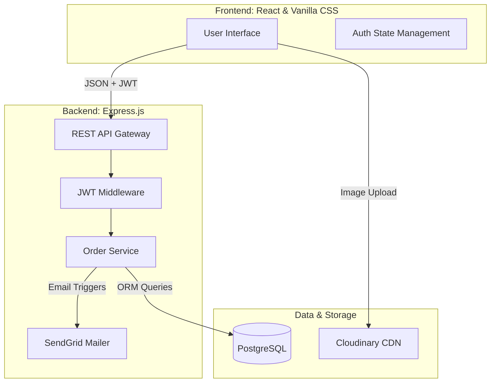
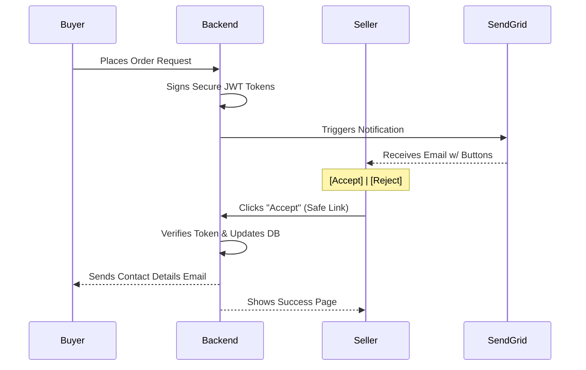

# UniCart Campus Marketplace

[](https://opensource.org/licenses/MIT)
[](http://makeapullrequest.com)

**UniCart** is a high-performance, peer-to-peer trading platform engineered specifically for university ecosystems. It leverages **Stateless Authentication**, **Relational Data Normalization**, and **Automated Communication Pipelines** to provide a seamless and secure experience for students.

---

## System Architecture

UniCart follows a clean, layered architecture designed for separation of concerns and high scalability.



---

## Key Features

### Security & core
- **Stateless Authentication**: Custom JWT implementation with Bcrypt hashing for secure, lightweight session management.
- **Transaction Integrity**: Atomic order processing that prevents race conditions and ensures item uniqueness.

### Automated Communications
- **SendGrid Integration**: Real-time notifications for every stage of the trade.
- **One-Click Email Actions**: Securely **Accept** or **Reject** orders directly from your inbox using signed tokens.

### Intelligent Catalog
- **Privacy-First Discovery**: Automatically filters out your own listings from your feed.
- **Clean Marketplace**: Hidden sold items and real-time status updates ensure a relevant shopping experience.

### Design Philosophy
- **"Clinical Minimalist" UI**: Built with pure **Vanilla CSS** for sub-100ms First Contentful Paint (FCP) and maximum performance.

---

## One-Click Order Flow

Our unique email-driven workflow minimizes friction for sellers, allowing them to finalize sales without even opening the app.



---

## Technical Stack

- **Frontend**: React (Vite), Vanilla CSS, Lucide Icons.
- **Backend**: Node.js, Express.js.
- **Database**: PostgreSQL with Prisma ORM.
- **Media**: Cloudinary CDN for image hosting.
- **Email**: SendGrid API.

---

## Getting Started

### Prerequisites
- **Node.js**: v20 or higher
- **PostgreSQL**: Local or Cloud (Neon/Supabase)

### 1. Environment Configuration
Create a `.env` file in the `backend` directory:
```env
DATABASE_URL="your_postgresql_url"
JWT_SECRET="your_secret"
CLOUDINARY_CLOUD_NAME="your_name"
CLOUDINARY_API_KEY="your_key"
CLOUDINARY_API_SECRET="your_secret"
SENDGRID_API_KEY="your_api_key"
FROM_EMAIL="your_verified_sender"
BACKEND_URL="http://localhost:5000"
```

### 2. Installation & Launch
```bash
# Backend Setup
cd backend
npm install
npx prisma db push
npm run dev

# Frontend Setup (New Tab)
cd frontend
npm install
npm run dev
```

---

## Future Roadmap
- [ ] **Real-Time Sockets**: Instant in-app messaging between buyers and sellers.
- [ ] **Advanced Search**: Fuzzy matching and category-based filtering.
- [ ] **Reviews & Ratings**: Building trust in the campus community.

---

## License
Distibuted under the MIT License. See `LICENSE` for more information.