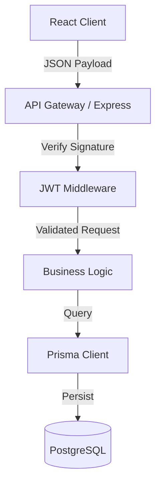
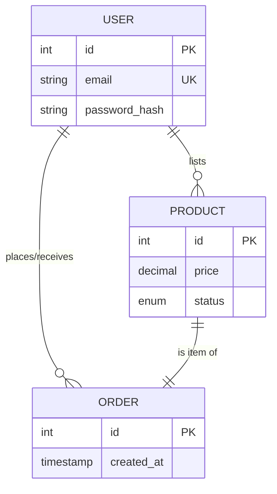

# UniCart Campus Marketplace

A secure, high-performance peer-to-peer trading platform designed for university environments. This project implements fundamental Full-Stack Engineering concepts, including **Stateless Authentication**, **Relational Database Normalization**, and a **Scalable Service Architecture** designed for transaction integrity.

---

## Key Features

- **Stateless Authentication**: custom JWT implementation with Bcrypt password hashing for secure, scalable session management.
- **Atomic Transactions**: Robust order processing logic that ensures data consistency between buyers, sellers, and inventory states.
- **Custom Design System**: A "Clinical Minimalist" UI engine built with **Vanilla CSS**, prioritizing render performance and strict typographic hierarchy over heavy frameworks.
- **Type-Safe Data Access**: Prisma ORM implementation ensuring rigorous schema validation and query efficiency.

---

## System Architecture

### Data Processing Pipeline
The system processes user interactions through a layered architecture to ensure separation of concerns and security.



### Database Schema Relationships
Designed with 3NF (Third Normal Form) to eliminate redundancy and enforce referential integrity.



---

## Core Concepts

### Why Vanilla CSS?
Modern frameworks often introduce significant bundle overhead. This project utilizes a custom CSS architecture to achieve O(1) style resolution and sub-100ms First Contentful Paint (FCP), complying with the "Clinical Minimalist" design philosophy.

### Transaction Integrity
Unlike standard social applications, a marketplace requires strict consistency. The backend creates a transactional lock/check during the order process:
1.  **Verify** Product Availability.
2.  **Lock** Product State.
3.  **Create** Order Record.
This prevents race conditions where two users might buy the same unique item simultaneously.

---

## Getting Started

### Prerequisites
- Node.js v20+
- PostgreSQL

### Build and Run
1. **Backend Initialization**:
   ```bash
   cd backend
   npm install
   npx prisma db push    # Sync Schema
   nodemon server.js     # Start Server
   ```

2. **Frontend Initialization**:
   ```bash
   cd frontend
   npm install
   npm run dev
   ```

---

## Future Roadmap

- [ ] **Real-Time Sockets**: Bi-directional communication for instant buyer-seller messaging.
- [ ] **Payment Orchestration**: Integration with Stripe Connect for escrow-based funds handling.
- [ ] **Next.js Migration**: Implementing Server-Side Rendering (SSR) for SEO optimization.

---

## Contributing
This project is part of a deep dive into secure e-commerce architecture.